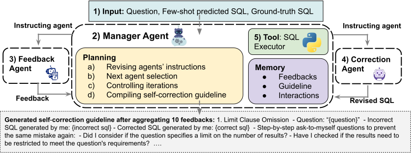

# MAGIC: Generating Self-Correction Guideline for In-Context Text-to-SQL
[](./readme.md)
[](./readme.md)

The repository of paper ["MAGIC: Generating Self-Correction Guideline for In-Context Text-to-SQL"](https://arxiv.org/abs/2406.12692).

If you use MAGIC's script, results, or trajectory data, please cite the following reference:

```bibtex

@article{askari2024magic,
  title={MAGIC: Generating Self-Correction Guideline for In-Context Text-to-SQL},
  author={Askari, Arian and Poelitz, Christian and Tang, Xinye},
  journal={arXiv preprint arXiv:2406.12692},
  year={2024}
}
```

## MAGIC




## Instructions for reproducing experiments

The code for reproducing experiments is located in the ```magic``` folder, and the bash scripts for using each code are in the ```scripts``` folder. Run the project from the root directory after downloading it.

### Setup
First, install the libraries listed in the requirements.txt file. Use the following commands:

  - ``````conda create --name magic python=3.10.14``````
  - ``````conda activate magic``````
  - ``````python3 -m pip install -r requirements.txt``````

Before running any experiments, download the BIRD and SPIDER datasets and store them in the data folder. For evaluation, use the official script released by each dataset. Update [./utils/llm_apis.py](./utils/llm_apis.py) for your GPT4 API access, as well in [magic/multi_agent_feedback_generation.py](magic/multi_agent_feedback_generation.py) and [magic/self_correction_with_guideline.py](magic/self_correction_with_guideline.py).

## Scripts
### 1. Multi Agent Feedback Generation with MAGIC
Run the feedback generation with the following command:

``````
./scripts/multi_agent_feedback_generation.sh
``````

Modify the path and parameters by editing the bash file for controlling number of threads and other params.

### 2.  Guideline generation with manager of MAGIC
Run the guideline generation with the following command:

``````
./scripts/guideline_generation.sh
``````

You can modify the path and parameters by editing the bash file.

### 3. Self-correction with the guideline automatically generated by MAGIC

Run the self-correction with the following command:

``````
/scripts/self_correction_with_guideline.sh
``````


You can modify the path and parameters by editing the bash file.

## Results
The results of experiments and trajectory data of agents' interactions are stored in the ```results``` folder.

## Datasets
We conducted experiments with MAGIC using two open-source datasets: [BIRD](https://bird-bench.github.io/) (licensed under CC BY-SA 4.0) and [SPIDER](https://github.com/taoyds/spider) (licensed under Apache-2.0), making them suitable for research purposes.

### SPIDER dataset
The SPIDER dataset consists of 10,181 questions and 5,693 unique complex SQL queries sourced from 200 databases across 138 domains. Each domain contains multiple tables, and the dataset is split into training, development, and test sets with 8,659, 1,034, and 2,147 examples, respectively. The queries are categorized into four difficulty levels based on factors such as SQL keywords, nested subqueries, and the use of column selections and aggregations.

### BIRD dataset
The BIRD dataset comprises 12,751 question-SQL pairs extracted from 95 relatively large databases (33.4 GB) spanning 37 professional domains including blockchain and healthcare. BIRD introduces external knowledge to enhance the accuracy of SQL query generation, adding complexity to the task.

### Trajectory dataset (Ours)
The trajectory dataset, generated by MAGIC, is publialy available [https://huggingface.co/datasets/microsoft/MAGIC](https://huggingface.co/datasets/microsoft/MAGIC). This dataset captures interactions between agents aimed at correcting incorrect SQL queries and generating guidelines. Each trajectory data file includes the following fields:
- **prompt**: the input prompt given to the agent
- **response**: the agent's response to the prompt
- **caller_agent**: identifies which agent was called during each iteration, with values like `feedback_agent_call_{iteration_number}`, `correction_agent_call_{iteration_number}`, and `manager_revises_prompt_iteration_{iteration_number}`.

The trajectory data file names include "success-True" or "success-False," indicating whether the interaction between agents successfully led to self-correction. A "False" value indicates that the maximum number of iterations (5) was reached without achieving successful self-correction.

## Intended use and out of scope uses 
The purpose of this research project is solely focused on generating self-correction guidelines for incorrect SQL queries through agent interactions. The trajectory data released is intended strictly for research purposes related to the text-to-SQL task and is not authorized for any other use. The method and the dataset should not be applied on any other domain than text-to-SQL. 

## Evaluation of our proposed method 
All evaluations have been done using state-of-the-art benchmarks, specifically the BIRD and SPIDER benchmarks as described above. 

## Limitations 
While our experiments illustrate the superior effectiveness of our self-correction guidelines in comparison to those developed by human experts, we have not conducted a systematic study to quantify the potential generation of hallucinated data during this process and its subsequent impact on the performance of the automatically generated guidelines. 

## Safe and responsible use 
This research project leverages advanced Language Learning Models (LLMs) to provide sophisticated natural language processing capabilities to generate feedback and to correct SQL queries. As powerful as these tools are, it is crucial to use them in a manner that is both safe and responsible. The all methods are intended to use the GPT-4 model from OpenAI, either via the OpenAI or Azure OpenAI APIs. See the [GPT-4 System Card](https://cdn.openai.com/papers/gpt-4-system-card.pdf) to understand the capabilities and limitations of this model. 


## Disclaimer
The purpose of this research project is solely focused on generating self-correction guidelines for incorrect SQL queries through agent interactions. The trajectory data released here is intended strictly for research purposes related to the text-to-SQL task and is not authorized for any other use.

## Contributing
This project welcomes contributions and suggestions.  Most contributions require you to agree to a
Contributor License Agreement (CLA) declaring that you have the right to, and actually do, grant us
the rights to use your contribution. For details, visit https://cla.opensource.microsoft.com.

When you submit a pull request, a CLA bot will automatically determine whether you need to provide
a CLA and decorate the PR appropriately (e.g., status check, comment). Simply follow the instructions
provided by the bot. You will only need to do this once across all repos using our CLA.

This project has adopted the [Microsoft Open Source Code of Conduct](https://opensource.microsoft.com/codeofconduct/).
For more information see the [Code of Conduct FAQ](https://opensource.microsoft.com/codeofconduct/faq/) or
contact [opencode@microsoft.com](mailto:opencode@microsoft.com) with any additional questions or comments.

## Pricacy
See [Microsoft Privacy Statement](https://www.microsoft.com/en-us/privacy/privacystatement)

## Trademarks
This project may contain trademarks or logos for projects, products, or services. Authorized use of Microsoft 
trademarks or logos is subject to and must follow 
[Microsoft's Trademark & Brand Guidelines](https://www.microsoft.com/en-us/legal/intellectualproperty/trademarks/usage/general).
Use of Microsoft trademarks or logos in modified versions of this project must not cause confusion or imply Microsoft sponsorship.
Any use of third-party trademarks or logos are subject to those third-party's policies.

## License
See [LICENSE](./LICENSE)